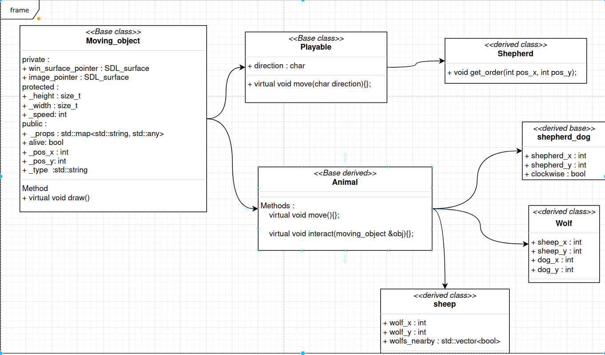

# SDL_Project

## 1.SDL Project Short Intro
The overall goal of the project is to create a game in which multiple species of animals exist and
proliferate. In the final version, we also want to add a controllable character. For instance one
could go for sheep, wolves, shepherd dogs and a shepherd as playable character. These animals
will then move around, interact with one another and also be influenced by the controlled
character. For visualization we will use the SDL2 libreary, see https://www.libsdl.org.
## 2.SDL API
• ** SDL Rect ** Defines a rectangle via its upper left (!) corner as well as its width and
height. We will mainly use this to position textures.
• ** SDL Surface ** Basically a rectangular array of pixels representing the screen or a tex-
ture. Note that loading a surface in SDL (using IMG Load) for instance, returns an
OWNING pointer to a surface. This means we need to ensure deletion by “hand” using
SDL FreeSurface.
• SDL CreateWindow Creates the actual “window” of the application. A pointer
to the corresponding surface is obtained via SDL GetWindowSurface. Note that
before quitting your program, the surface needs to be freed and the window closed
(SDL DestroyWindow), in this order.
• SDL FillRect Fills a surface with a single color. Called to clear the screen before
drawing each object.
• SDL BlitScaled Scales and translates a texture to match a given rectangle and “draw”
onto the given surface.
• SDL UpdateWindowSurface Updates what is actually shown on the screen.
• SDL GetTicks and SDL Delay Can be used to control your framerate. SDL GetTicks
returns the time passed since initialization in milliseconds, SDL Delay(x) blocks the
execution for x milliseconds.
## 3.Needed classes and their structure

• animal a base class for all animals. As all animals need to be drawn onto the screen,
they need a texture (SDL Surface loaded from image), a position (in x and y), a method
draw, that allows to draw them to a given screen, a finally virtual method defining the
movement.
• sheep, wolf etc derived from animal. Needs to load the correct texture, choose an
initial position, destroy the texture on destruction and has to implement the movement
function. Note that for the first part, sheep can simply follow straight lines and bounce
of the edge of the window (Like the old windows screen saver); wolves move randomly
or go to the nearest sheep (bonus)
• A ground object ground representing the “arena”. Members: A counter (of type
unsigned) defining the framerate.
Needs a constructor, destructor and a function called loop() doing the actual work (It
corresponds to the “main” loop of your program). Members: ground Holds a NON-
OWNING ptr to the screen (See main application). A vector of (smart?) pointers with
all the animals currently existing.

## Run project
cd Project_SDL_base 
./run.sh (option)[number of sheeps] [number of wolfs] [durations] 
(by default, the number of sheeps is 2, the number of wolfs is 2,the duration is 10 seconds)
